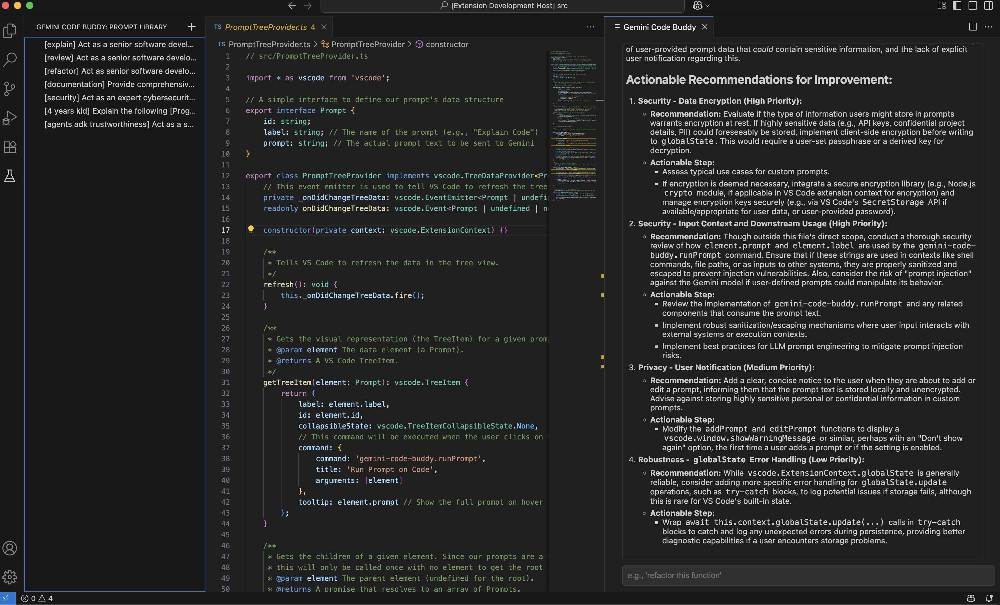

# Gemini Code Buddy README

**Gemini Code Buddy** is your personal AI pair programmer, powered by Google's Gemini models, living directly inside your Visual Studio Code editor. Analyze your current code, ask questions, refactor, generate documentation, and more through an intuitive chat interface.

> Tip: We recommend creating a short animation showing the chat panel and prompt library in action and replacing the image above.

---
## Features

* **AI Chat Panel**: Opens a chat view in a separate column, allowing you to interact with Gemini without leaving your code.
* **Context-Aware Analysis**: Automatically uses your currently open code file (or your selected text) as the context for your prompts.
* **Code Generation & Refactoring**: Ask Gemini to write new functions, refactor existing code, or add comments.
* **Apply Code with One Click**: When Gemini provides a code block, an "Apply Code" button appears, allowing you to directly insert the suggestion into your editor.
* **Formatted Responses**: Gemini's answers are rendered in Markdown, making lists, bold text, and code snippets easy to read.
* **Custom Prompt Library**: A dedicated sidebar view lets you save, manage, and reuse your favorite and most effective prompts, streamlining your workflow.

---
## Requirements

The only requirement is a **Google Gemini API key**. You can get one for free from [Google AI Studio](https://aistudio.google.com/app/apikey).

---
## Extension Settings

This extension contributes the following settings:

* `gemini-code-buddy.apiKey`: Your Google AI Studio API key. This is required for the extension to function.

To configure the key:
1.  Press **Cmd/Ctrl + ,** to open the VS Code settings.
2.  Search for **"Gemini Code Buddy API Key"**.
3.  Paste your key into the input box.

---
## Quick Start

1.  Install the extension.
2.  Set your API key in the VS Code settings (see above).
3.  Open any code file in the editor.
4.  Open the Command Palette (**Cmd/Ctrl + Shift + P**) and run the command **"Start Gemini Code Buddy"**.
5.  The chat panel will open, and you can start asking questions about your code!

---
## Release Notes

### 1.0.0

Initial release of Gemini Code Buddy, including:
* Core chat functionality with Gemini.
* Context awareness of the active editor.
* Markdown rendering for responses.
* "Apply Code" feature for code blocks.
* Sidebar view for managing a custom prompt library.

**Enjoy!**